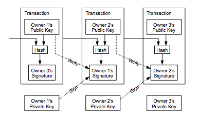
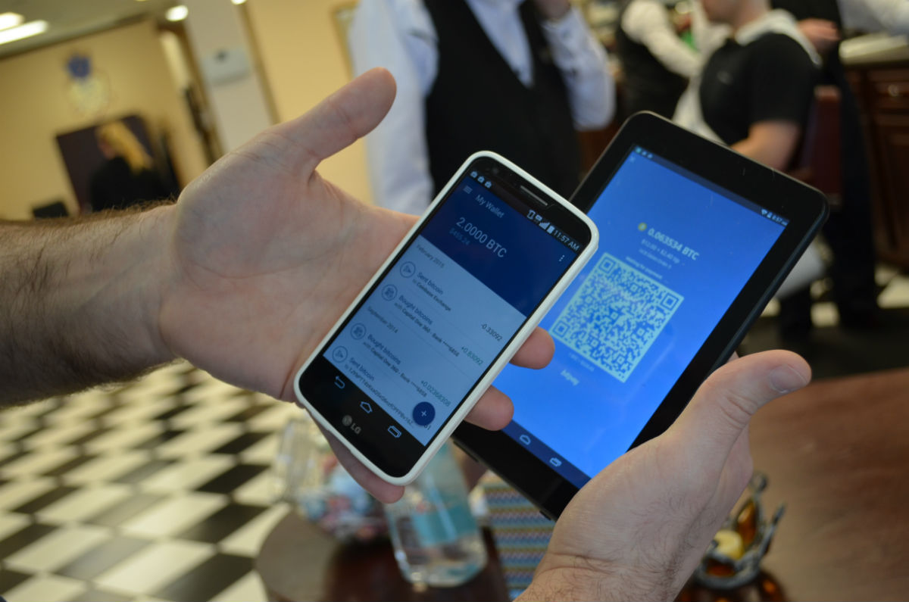

# Fake News - a Technological Approach to Proving Provenance Using Blockchains

by Steven Huckle - s.huckle@sussex.ac.uk

_Source: [Bitnation](https://tinyurl.com/nktt7tx)_

- - -

## Objectives

> + Provide an Overview of Blockchain Technology
> + Introduce My Fake News Paper
> + Demonstrate Blockchain Provenance

## Table of Contents

> + Blockchain Introduction
> + Introduce Fake News Paper
> + Demonstrate Blockchain Provenance
> + Summarise the Use Case Demonstrated

# Blockchain Overview

_Source: bitcoinspace.net_

- - -

## Blockchain - Table of Contents

> + Technical Background
> + Blockchain Overview
> + Bitcoin
> + Ethereum
> + Summary

## Technical Background

+ Cryptography
+ Peer-to-peer (P2P), Decentralised and Distributed Computer Systems
+ Consensus

## Cryptography

The mathematics of information security.

+ Public-key Cryptography (PKC) - A form of encryption that creates a public key, which is shared, widely, and a private key, which is known only to the owner
+ Cryptographic Hash Functions - Maps arbitrary data to a unique fixed-size string
+ Digital Signatures - Identity authentication that allows users to digitally sign their messages

## Peer-to-peer (P2P), Decentralised and Distributed Computer Systems

+ P2P - A network where its participants are both resource providers and resource requesters
+ Decentralised
	+ Architecturally
	 	+ Fault tolerance
		+ Attack resistance
		+ Collusion resistance
 	+ Politically - Control is not ceded to one individual or organisation
+ Distributed - A decentralised system that is logically centralised

## Consensus

Protocols that define how global agreement is reached in a distributed system.

## Blockchain Overview

+ A public asset ledger of propagated values, which are coalesced into blocks of transactions
+ Decentralised authority, so blockchains are _trustless_ -
+ Changes are tracked and write permissions are controlled by public key cryptography
+ Technically infeasible to make changes to transactions already on the blockchain
+ Hence, a blockchain represents a historical record of all transactions ever recorded by the network.

## Blockchain Transactions

_Source: [Bitcoin: A Peer-to-Peer Electronic Cash System by Satoshi Nakamoto](https://bitcoin.org/bitcoin.pdf "Bitcoin White Paper")_

## The Blockchain As a State Transition System

Given an original state **S**, a transaction **TX**, and a new state **S'**, we have:

	APPLY(S,TX) -> S’ or ERROR

Algorithmically, each transaction is a function that takes a state consisting of the collection of all unspent transaction outputs (UTXO) that are changed to a different state in the  form of new UTXO:

	For each input in TX:
		If the referenced UTXO is not in S:
			return ERROR.
     		else if the cryptographic signature does not match
			the owner of the UTXO: 					
				return ERROR.
    		else if the sum of all input UTXO is less than the
			sum of all output UTXO:
				return ERROR.
    		else:
				remove all input UTXO.
				add all output UTXO.
		return S'.

## Valid Blockchain Transactions

1. **Authorised**: They should be authorised so that only _user x_ can perform
transactions under the guise of _user x_. This is achieved through public key cryptography
2. **Read-only**: Once on the system, transactions cannot be modified. Again, achieved through cryptography
3. **Final**: Transactions cannot be deleted. The time stamping and hashing functions of workers on the blockchain network help ensure finality
4. **Uncensored**: As long as the transaction conforms to the blockchain’s protocol,
it should be added to the ledger.
5. **Consistent** : Conformance to the present state of the blockchain is achieved by encoding transactions into a time-stamped Merkle Tree.

## Validating Transactions

A fundamental concept of blockchain technologies is that validators must prove that they've completed _something difficult_.

## Overview of the Validation Process

Bitcoin validates transactions using **Proof of Work** (PoW) consensus. That's a scheme based on a **SHA-256** hashing algorithm, which produces a hash with a value less than a target **nonce**. Calculating the hash, known as **mining**, takes approximately ten minutes.

. . .

The validation process produces a block that contains a **timestamp**, a **nonce** and the root hash of a **Merkle Tree** of all transactions for that block.

. . .

Finally, the block is broadcast so that network nodes can decide on its validity.

_Source: bitcoin.org_

## The Blockchain

_Source: [Bitcoin: A Peer-to-Peer Electronic Cash System by Satoshi Nakamoto](https://bitcoin.org/bitcoin.pdf "Bitcoin White Paper")_

## Summarising Blockchain Design

_Jonathan Chester_, writing in [Forbes Magazine](http://www.forbes.com/sites/jonathanchester/2016/04/14/the-blockchain-wars-how-startups-and-enterprises-are-competing-to-create-the-web-2-0/), says this:

_"Think of the blockchain as a spool of Kevlar tape kept in the middle of the town square, and consensus about a block is equivalent to writing on the tape with indelible ink."_

. . .

A blockchain represents an irrevocable representation of the truth because it's a permanent and complete record of every transaction that’s ever taken place.

. . .

The [Bitcoin Website FAQ](https://bitcoin.org/en/faq) puts it this way:

_"Blockchains are the most prominent **triple entry bookkeeping system** in existence."_

## Bitcoin

_Source: Ariel Zambelich/Wired_

- - -

## Bitcoin Overview

_"Bitcoin is a **consensus network** that enables a new payment system and a completely **digital money**. It is the first decentralised **peer-to-peer payment network** that is powered by its users with **no central authority** or middlemen. From a user perspective, Bitcoin is pretty much like **cash for the internet**. Bitcoin can also be seen as the most prominent **triple entry bookkeeping system** in existence."_

_Bitcoin Website FAQ_

## The Problems Addressed by Bitcoin

+ It obfuscates much of modern money's trust mechanisms
+ Cryptographic proofs allow parties to transact directly, thus removing the need for a third-parties to verify payments.
+ Cryptography also ensures authenticity. Hence, as opposed to its physical banknote counterparts, BTC suffers none of the issues of forgery
+ Distributed consensus solves the problem of double spending
+ Trusted identity gives the system a natural way of overcoming 'Sybil Attacks', where a single faulty entity can present multiple identities and control a substantial fraction of a system
+ Provides a solution to a conundrum in distributed computing, known as the _Byzantine Generals Problem_. Byzantine Fault Tolerant systems must reach dependable consensus, even under the circumstances where individual components have failed.

## Bitcoin's Key Concepts

## How does Bitcoin work?

> + Paying with bitcoin means creating a record of the transaction in the **blockchain**
> + The blockchain is a distributed, historical record of all Bitcoin transactions, recorded in **blocks**
> + **Miners** on the network use their computing power to verify the transactions, grouping them into blocks
> + Using the block transaction data as inputs, miners race to solve a computationally intensive cryptographic puzzle in order to win **new bitcoins**, hence Bitcoin is referrred to as a **cryptocurrency**
> + Difficulty of the puzzle is automatically adjusted so that a new block is mined every **10mins**

## Bitcoin Consensus

_Satoshi Nakamoto_, in the [original Bitcoin white paper](https://bitcoin.org/bitcoin.pdf "Bitcoin White Paper"), describes the consensus process by which the blockchain is formed:

1. All nodes receive a broadcast of new transactions.
2. Each node collects new transactions into a block.
3. Each node (miner) tries to find a PoW for its block.
4. When a node finds a PoW, it broadcasts the new block to all nodes.
5. Nodes accept the block only if all of the transactions it contains are valid.
They must not have been spent already.
6. Nodes express their acceptance of the block by working on creating the
next block.
7. Nodes use the hash of the accepted block as the previous hash (thus forming
the chain).

## How Is Bitcoin Different From the £?

> + Digital only - No physical currency
> + No central bank (no governmental control)
> + No individual unit with identifiers (e.g. serial numbers)
> + Automated control of money supply (capped to 21 million bitcoins)
> + Trust-free system (no third parties required)
> + Transactions are anonymous (but may be traceable)

Fiat currency is state backed currency, such as the $ or £.

## Bitcoin Software

+ Wallets / Clients (open source)
	+ Connect to the network to process transactions
	+ Manage bitcoins
	+ Protect encryption key
+ Mining software (open source)
	+ Generate new bitcoins
	+ Process the blockchain

## Ethereum

Blah

## Smart Contracts

+ Algorithms that provide a secure mechanism for electronic collaboration which does not rely upon a central authority for trust
+ Helps automate a system’s rule set via autonomous scripts that can represent verifiable application logic

# Fake News

_Source: Birmingham Mail_

- - -

## Fake News Paper

My article on Fake News describes a photo that a prominent supporter of Donald Trump claimed showed the Clinton Campaign doctoring votes. The New York Times went to great lengths to prove the picture was fake; I create a scenario where the paper is saved a lot of bother because the photographer uses my blockchain app' to establish the origins of her snap.

# Provenator

Demonstration...

- - -

# Wrapping Up

_Source: [Open Clipart](https://openclipart.org/detail/220024/parcel-bw)_

- - -

## Conclusions

> + Fake News reached a crescendo during the 2016 US Presidential Election
> + Introduced [Provenator](https://github.com/glowkeeper/Provenator), a prototype dApp for proving the origins of digital media
> + Conclusion - the trust mechanisms of blockchain technology can show the provenance of any source of digital media
> + However, Provenator is incapable of proving the authenticity of a news story as a whole. That takes human skills

## Presentation

This presentation is available at [GitHub](https://github.com/glowkeeper/digitalDiscoveryPresentation).

The presentation is just HTML5, so it runs in a browser, as though it's a traditional website. It was produced with 100% open source tools, including [Pandoc](https://pandoc.org/) and [reveal.js](https://github.com/hakimel/reveal.js/ "reveal.js"), as well as an open source markup language, [Markdown](https://daringfireball.net/projects/markdown/).

# Thank You

Support open source! Open data! Open standards in general!

Steven Huckle - s.huckle@sussex.ac.uk
